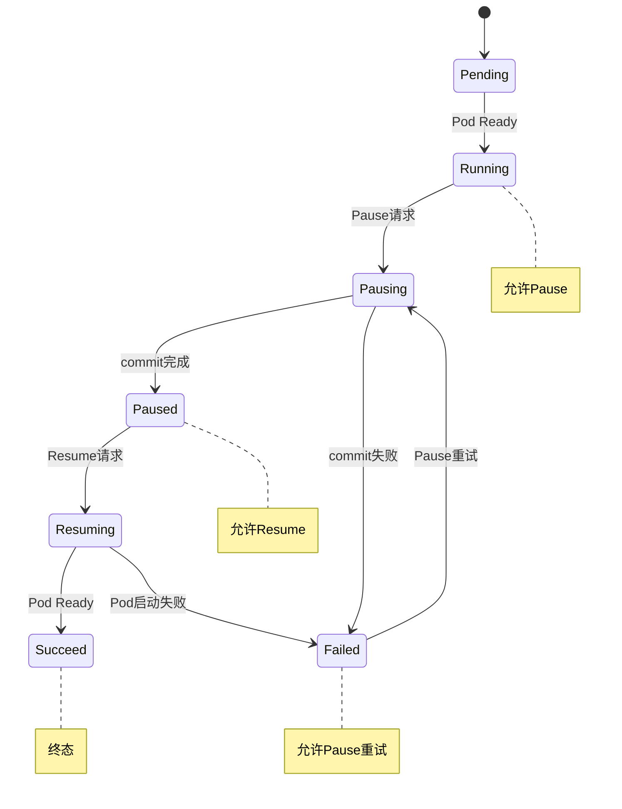

本文档面向 Server 层开发者，描述 BatchSandbox Pause/Resume 功能和 SandboxSnapshot 独立创建的 API 使用方式。

---

## 一、BatchSandbox Pause/Resume API

### 1.1 核心字段

#### spec.pause（Server 写入）

| 值 | 含义 | 触发条件 |
|---|---|---|
| `nil` | 无操作（初始/完成状态） | 默认值，或 Controller 完成操作后清空 |
| `true` | 请求暂停 | Server 发起 Pause 请求 |
| `false` | 请求恢复 | Server 发起 Resume 请求 |

**写入规则：**
- 每次写入 `spec.pause`（`nil→true` / `nil→false`）均触发 `metadata.generation` +1
- Controller 完成操作后会清空为 `nil`，为下一次操作复位

#### status.phase（Server 只读）

| Phase | 含义 | 终态？ | 允许的操作 |
|---|---|---|---|
| `Pending` | Pod 创建中，尚未 Running | 否 | 无 |
| `Running` | 正常运行 | 否 | Pause ✓ |
| `Pausing` | Pause 操作进行中 | 否 | 无（等待完成） |
| `Paused` | 已暂停，无 Pod 运行 | 否 | Resume ✓ |
| `Resuming` | Resume 操作进行中 | 否 | 无（等待完成） |
| `Succeed` | 所有操作成功完成 | ✓ 终态，不再变化 | 需 PATCH spec 触发新周期 |
| `Failed` | 操作失败 | 否 | Pause ✓（重试） |

#### status.conditions[]（Server 只读）

Phase 为 `Failed` 时，通过 conditions 区分具体失败原因：

| Condition Type | 含义 | 出现场景 |
|---|---|---|
| `PauseFailed` | Pause 操作失败 | commit/push 失败、Pod 不存在、Pool template 固化失败 |
| `ResumeFailed` | Resume 操作失败 | 快照不存在、Pod 启动失败 |
| `PodFailed` | Pod 异常 | Pod CrashLoopBackOff、ImagePullBackOff |

Condition 结构：

```json
{
  "type": "PauseFailed",
  "status": "True",
  "lastTransitionTime": "2026-04-16T00:00:00Z",
  "message": "push image failed: connection refused",
  "reason": "PushFailed"
}
```

### 1.2 前置校验矩阵

Server 在发起 Pause/Resume 请求前，必须校验 `status.phase`：

| `status.phase` | 允许 Pause？ | 允许 Resume？ |
|---|---|---|
| `Pending` | ✗ 409 Conflict | ✗ 409 Conflict |
| `Running` | ✓ | ✗ 409 Conflict |
| `Pausing` | ✗ 409 Conflict | ✗ 409 Conflict |
| `Paused` | ✗ 409 Conflict | ✓ |
| `Resuming` | ✗ 409 Conflict | ✗ 409 Conflict |
| `Succeed` | ✗ 409 Conflict | ✗ 409 Conflict |
| `Failed` | ✓（重试） | ✗ 409 Conflict |

### 1.3 使用示例

#### Pause 流程

```bash
# 1. 校验当前状态
GET /apis/sandbox.opensandbox.io/v1alpha1/namespaces/default/batchsandboxes/my-sandbox
# 检查 status.phase == "Running"

# 2. 发起 Pause 请求
PATCH /apis/sandbox.opensandbox.io/v1alpha1/namespaces/default/batchsandboxes/my-sandbox
Content-Type: application/merge-patch+json

{
  "spec": {
    "pause": true
  }
}

# 3. 轮询等待完成
GET /apis/sandbox.opensandbox.io/v1alpha1/namespaces/default/batchsandboxes/my-sandbox
# status.phase == "Paused"
```

#### Resume 流程

```bash
# 1. 校验当前状态
GET /apis/sandbox.opensandbox.io/v1alpha1/namespaces/default/batchsandboxes/my-sandbox
# 检查 status.phase == "Paused"

# 2. 发起 Resume 请求
PATCH /apis/sandbox.opensandbox.io/v1alpha1/namespaces/default/batchsandboxes/my-sandbox
Content-Type: application/merge-patch+json

{
  "spec": {
    "pause": false
  }
}


# 3. 确认完成
GET /apis/sandbox.opensandbox.io/v1alpha1/namespaces/default/batchsandboxes/my-sandbox
# status.phase == "Running"
```

### 1.4 状态转换图



### 1.5 错误处理

| 场景 | status.phase | conditions | Server 行为 |
|---|---|---|---|
| Pause 失败（commit/push 失败） | `Failed` | `PauseFailed` | 返回错误，sandbox 仍可用；可重试 Pause |
| Pause 失败（Pod 不存在） | `Failed` | `PauseFailed` | sandbox 不可用，需重建 |
| Pause 失败（Pool template 固化失败） | `Failed` | `PauseFailed` | sandbox 仍可用（Pool Pod 仍在） |
| Resume 失败（Pod 启动失败） | `Failed` | `ResumeFailed` | sandbox 不可用，需重新 Pause 获取新快照 |
| Pod 异常（CrashLoop/ImagePull） | `Failed` | `PodFailed` | sandbox 不可用 |

---

## 二、SandboxSnapshot API（独立创建）

### 2.1 使用场景

SandboxSnapshot 是原子能力，用于将 Pod 状态持久化为镜像。适用于：
- 独立快照（非 Pause/Resume 流程）
- 手动触发镜像保存

### 2.2 核心字段

#### spec（调用者填写）

| 字段 | 类型 | 必填 | 说明 |
|---|---|---|---|
| `sandboxName` | string | ✓ | 目标 BatchSandbox 名称（同 namespace） |

#### status（调用者只读）

| 字段 | 类型 | 说明 |
|---|---|---|
| `phase` | string | `Pending` / `Committing` / `Succeed` / `Failed` |
| `containers[]` | array | 快照结果（Succeed 后填入） |
| `containers[].containerName` | string | 容器名称 |
| `containers[].imageUri` | string | 快照镜像地址 |
| `containers[].imageDigest` | string | 镜像摘要（可选） |
| `conditions[]` | array | 状态条件数组 |
| `conditions[].type` | string | 条件类型（见下表） |
| `conditions[].status` | string | `True` / `False` |
| `conditions[].lastTransitionTime` | Time | 最近一次状态转换时间 |
| `conditions[].message` | string | 人类可读的状态说明 |
| `conditions[].reason` | string | 机器可读的状态原因 |
| `sourcePodName` | string | 源 Pod 名称 |
| `sourceNodeName` | string | 源节点名称 |

**SandboxSnapshot Condition Types：**

| Type | 含义 |
|---|---|
| `Ready` | 快照已就绪，镜像可使用 |
| `Failed` | 快照失败（commit/push 错误等） |

### 2.3 使用示例

```bash
# 1. 创建 SandboxSnapshot
POST /apis/sandbox.opensandbox.io/v1alpha1/namespaces/default/sandboxsnapshots
Content-Type: application/json

{
  "apiVersion": "sandbox.opensandbox.io/v1alpha1",
  "kind": "SandboxSnapshot",
  "metadata": {
    "name": "my-snapshot"
  },
  "spec": {
    "sandboxName": "my-sandbox"
  }
}

# 2. 轮询等待完成
# status.phase: Pending → Committing → Succeed

# 3. 获取快照结果
GET /apis/sandbox.opensandbox.io/v1alpha1/namespaces/default/sandboxsnapshots/my-snapshot
# status.phase == "Succeed"
# status.containers[0].imageUri = "registry/my-image:snap-gen123"

# 4. 使用完成后删除
DELETE /apis/sandbox.opensandbox.io/v1alpha1/namespaces/default/sandboxsnapshots/my-snapshot
```

### 2.4 注意事项

- 一个 BatchSandbox 可以创建多个 SandboxSnapshot，`metadata.name` 由调用者自行指定
- 创建 SandboxSnapshot 不会影响源 Pod 运行
- Registry、PushSecret 等配置由 Controller Manager 启动参数提供，无需写入 spec

---

## 三、字段变更历史

| 版本 | 变更 |
|---|---|
| v1alpha1 | 新增 `spec.pause` 字段 |
| v1alpha1 | 新增 `status.phase` 字段（含 `Succeed` 终态） |
| v1alpha1 | 新增 `status.conditions[]` 字段（PauseFailed / ResumeFailed / PodFailed） |
| v1alpha1 | SandboxSnapshot `status.phase` Ready → Succeed |
| v1alpha1 | SandboxSnapshot 新增 `status.conditions[]`（替代原 message / readyAt） |

---

## 四、FAQ

**Q: Pause 请求后，如何判断操作完成？**

A: 轮询 BatchSandbox，检查 `status.phase == "Paused"` 且 `spec.pause == nil`。

**Q: Pause 失败后 sandbox 还能使用吗？**

A: 如果 `status.phase == "Failed"` 但 Pod 仍在运行，sandbox 可继续使用。可重新发起 Pause 请求重试。

**Q: Resume 完成后 status.phase 是什么？**

A: `Succeed`（终态）。此后不会再自动变化，除非 Server PATCH spec 触发新周期。

**Q: Resume 后 Pod 的镜像是什么？**

A: Resume 后 Pod 使用 Pause 时保存的快照镜像，`spec.template` 中的 image 会被替换。

**Q: Pool 模式下 Pause/Resume 有区别吗？**

A: Server 层 API 无区别。Pool 模式下 Resume 后 BatchSandbox 会脱 Pool，后续按普通模式运行。

**Q: 能否在 Paused 状态下再次 Pause？**

A: 不能。必须先 Resume 到 Running，才能再次 Pause。
